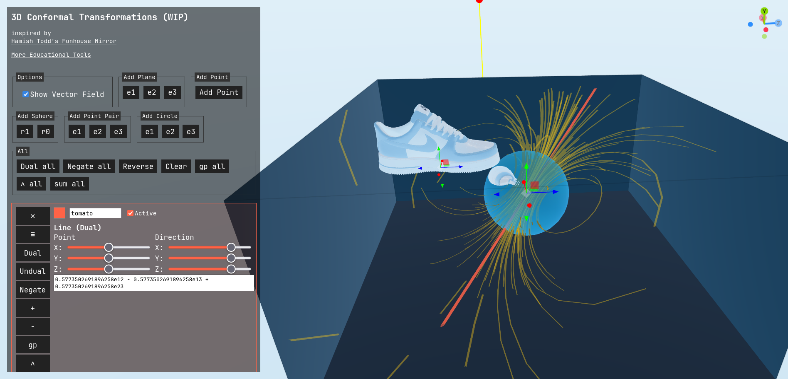
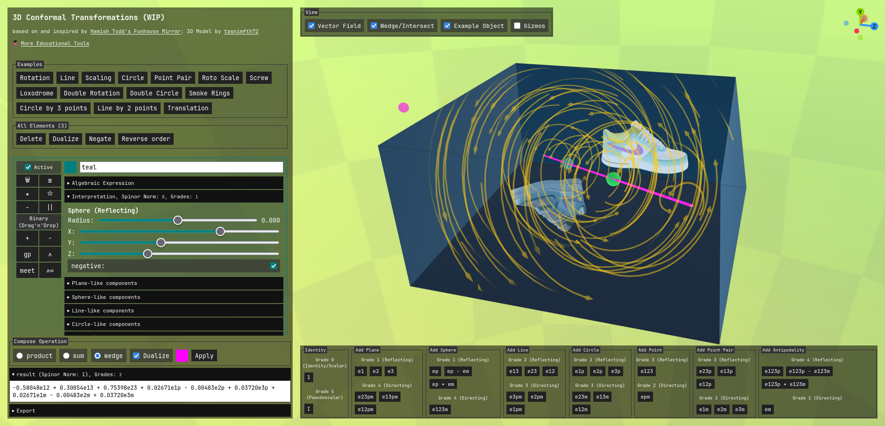
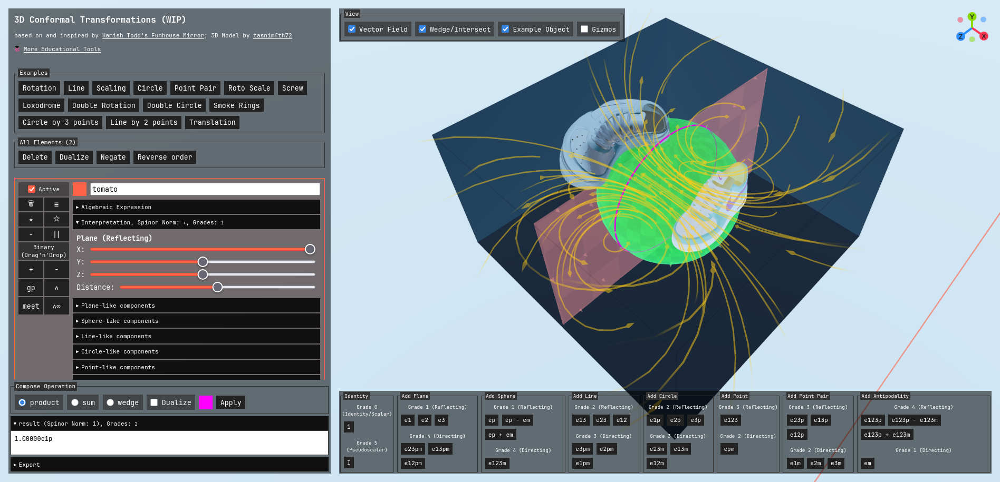
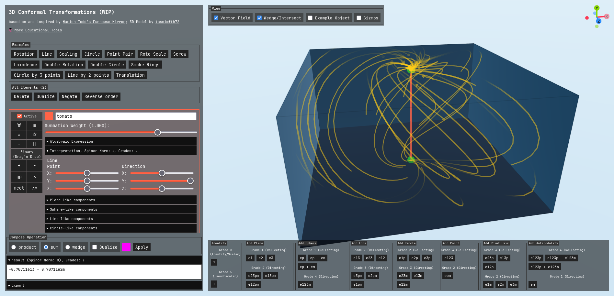
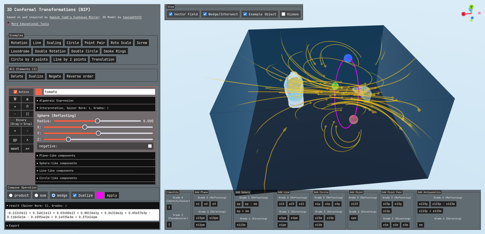
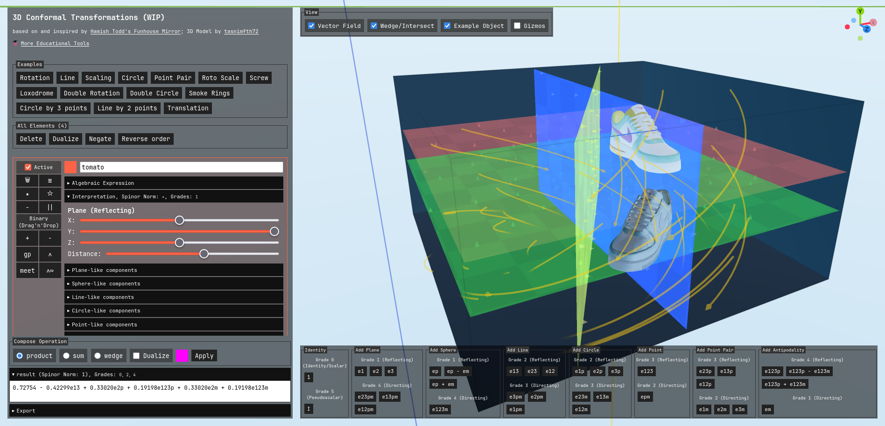
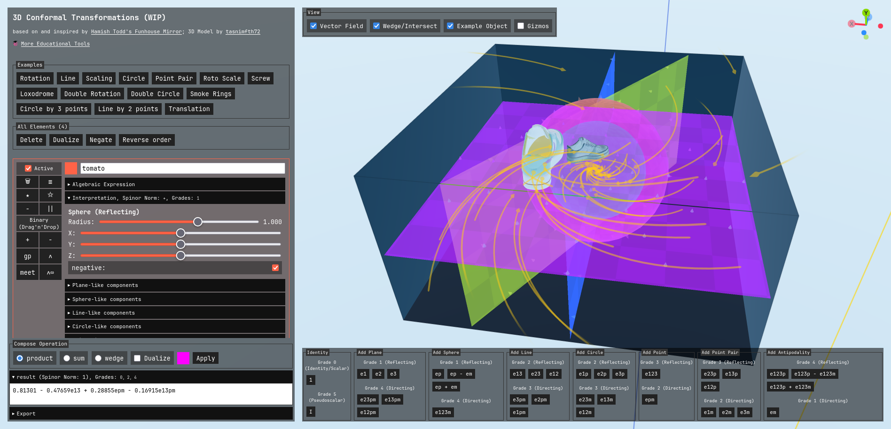
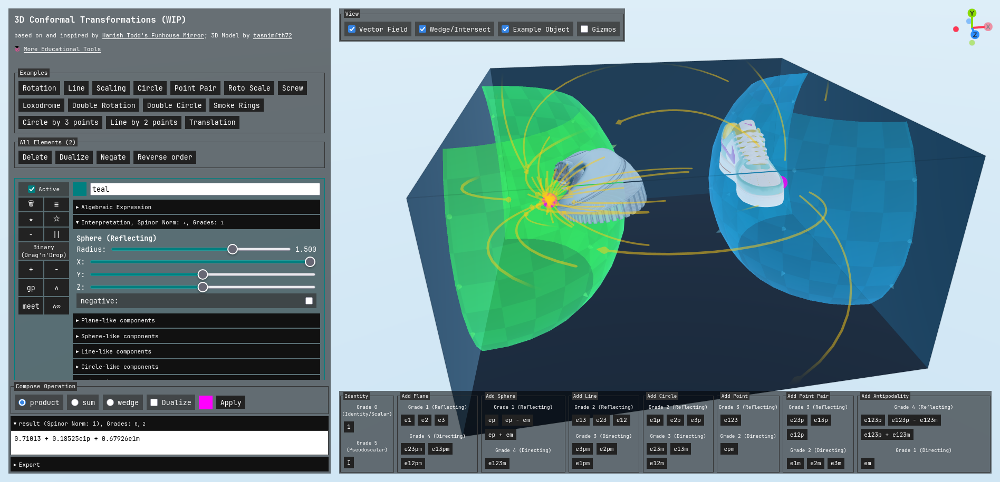

# 3D Conformal Geometry Experiment

This might end up as an educational experiment of reverse engineering the [tool presented in this video](https://www.youtube.com/watch?v=q3as9SGmDdw).



[Live Demo](https://static.laszlokorte.de/conformal-3d/)

## Screenshots

### Line through points

[
Live Demo](https://static.laszlokorte.de/conformal-3d/#e=1:1:tomato:0,-0.573251,0.391915,0,0.668095,0,0,0,0.035718,0,0,0,0,0,0,0,-0.964282,0,0,0,0,0,0,0,0,0,0,0,0,0,0,0;1:1:limegreen:0,0.597485,-0.188826,0,-0.453595,0,0,0,0.200804,0,0,0,0,0,0,0,-0.799196,0,0,0,0,0,0,0,0,0,0,0,0,0,0,0;1:1:royalblue:0,0,0,0,0,0,0,0,1,0,0,0,0,0,0,0,1,0,0,0,0,0,0,0,0,0,0,0,0,0,0,0&c=wedge&v=1&d=1)

### Circle through Sphere and Plane

[
Live Demo](https://static.laszlokorte.de/conformal-3d/#e=1:1:tomato:0,1,0,0,0,0,0,0,0,0,0,0,0,0,0,0,0,0,0,0,0,0,0,0,0,0,0,0,0,0,0,0;1:1:limegreen:0,0,0,0,0,0,0,0,-1,0,0,0,0,0,0,0,0,0,0,0,0,0,0,0,0,0,0,0,0,0,0,0&c=product&v=1&d=0)

### Loxodrome

[
Live Demo](https://static.laszlokorte.de/conformal-3d/#e=1:1:tomato:0,0,0,0,0,-1,0,0,0,0,0,0,0,0,0,0,0,0,0,0,0,0,0,0,0,0,0,0,0,0,0,0;1:1:limegreen:0,0,0,0,0,0,0,0,0,0,0,0,0,0,0,0,0,0,-1,0,0,0,0,0,0,0,0,0,0,0,0,0&c=sum&v=1&d=0)
[
Live Demo](https://static.laszlokorte.de/conformal-3d/#e=1:1:tomato:0,-0.52,0,0,-1.15,0,0,0,0.29645,0,0,0,0,0,0,0,1.29645,0,0,0,0,0,0,0,0,0,0,0,0,0,0,0;1:1:limegreen:0,-0.34,-0.1,0,0.47,0,0,0,-0.32675,0,0,0,0,0,0,0,0.67325,0,0,0,0,0,0,0,0,0,0,0,0,0,0,0;1:1:royalblue:0,-0.56,0.94,0,0,0,0,0,0.0986,0,0,0,0,0,0,0,1.0986,0,0,0,0,0,0,0,0,0,0,0,0,0,0,0&c=wedge&v=1&d=1)

### Screw motion

[
Live Demo](https://static.laszlokorte.de/conformal-3d/#e=1:1:tomato:0,0,1,0,0,0,0,0,0.28,0,0,0,0,0,0,0,0.28,0,0,0,0,0,0,0,0,0,0,0,0,0,0,0;1:1:limegreen:0,0,1,0,0,0,0,0,-0.17386,0,0,0,0,0,0,0,-0.17386,0,0,0,0,0,0,0,0,0,0,0,0,0,0,0;1:1:royalblue:0,1,0,0,0,0,0,0,0,0,0,0,0,0,0,0,0,0,0,0,0,0,0,0,0,0,0,0,0,0,0,0;1:1:gold:0,0.864507,0,0,0.50262,0,0,0,0,0,0,0,0,0,0,0,0,0,0,0,0,0,0,0,0,0,0,0,0,0,0,0&c=product&v=1&d=0)

### Rotation and Scaling


[Live Demo](https://static.laszlokorte.de/conformal-3d/#e=1:1:tomato:0,0,0,0,0,0,0,0,-1,0,0,0,0,0,0,0,0,0,0,0,0,0,0,0,0,0,0,0,0,0,0,0;1:1:limegreen:0,0,0,0,0,0,0,0,-0.73805,0,0,0,0,0,0,0,0.26195,0,0,0,0,0,0,0,0,0,0,0,0,0,0,0;1:1:royalblue:0,1,0,0,0,0,0,0,0,0,0,0,0,0,0,0,0,0,0,0,0,0,0,0,0,0,0,0,0,0,0,0;1:1:gold:0,0.862698,0,0,0.505719,0,0,0,0,0,0,0,0,0,0,0,0,0,0,0,0,0,0,0,0,0,0,0,0,0,0,0&c=product&v=1&d=0)

### Point pair

[
Live Demo](https://static.laszlokorte.de/conformal-3d/#e=1:1:tomato:0,-2,0,0,0,0,0,0,-0.375,0,0,0,0,0,0,0,-1.375,0,0,0,0,0,0,0,0,0,0,0,0,0,0,0;1:1:limegreen:0,-2,0,0,0,0,0,0,0.375,0,0,0,0,0,0,0,1.375,0,0,0,0,0,0,0,0,0,0,0,0,0,0,0&c=product&v=1&d=0)

## Developing

Once you've created a project and installed dependencies with `npm install` (or `pnpm install` or `yarn`), start a development server:

```sh
npm run dev

# or start the server and open the app in a new browser tab
npm run dev -- --open
```

## Building

To create a production version of your app:

```sh
npm run build
```

You can preview the production build with `npm run preview`.

## 3d Model

https://www.cgtrader.com/designers/tasnimfth72?utm_source=credit&utm_source=credit_item_page
